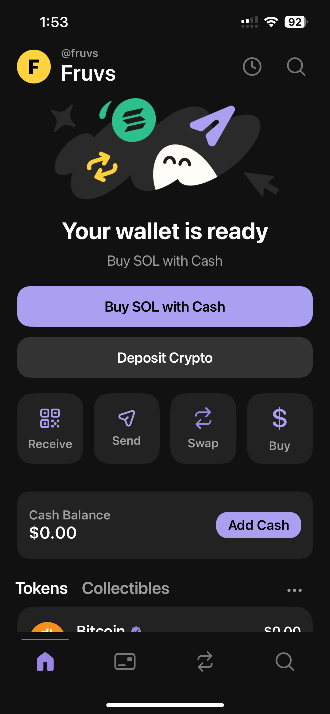
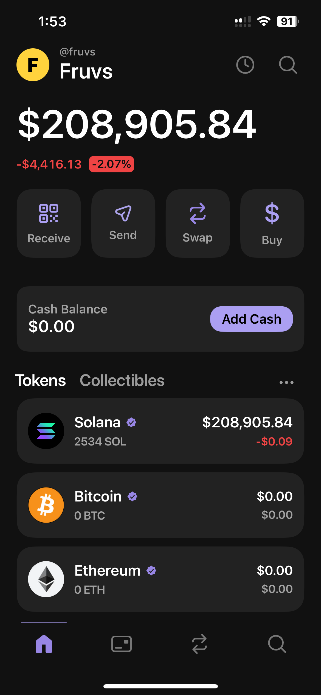
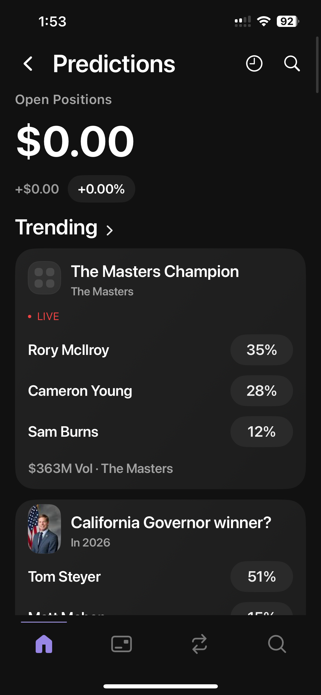
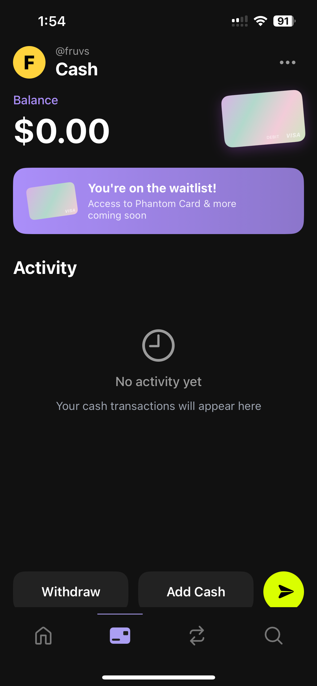
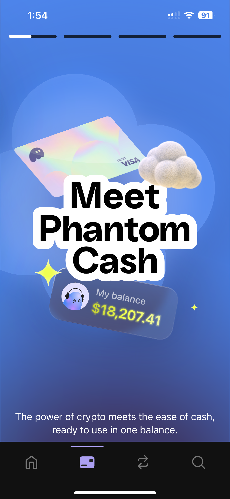
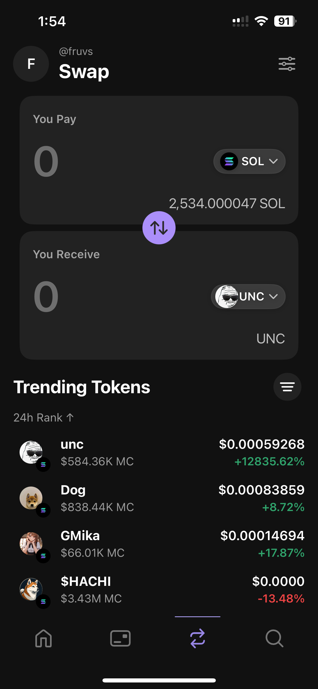
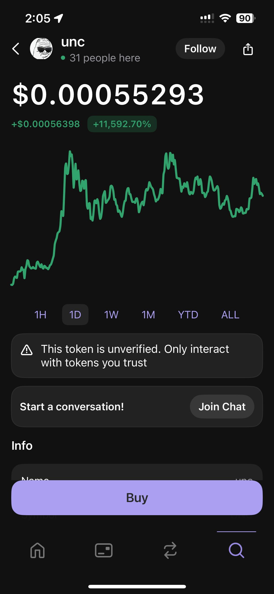
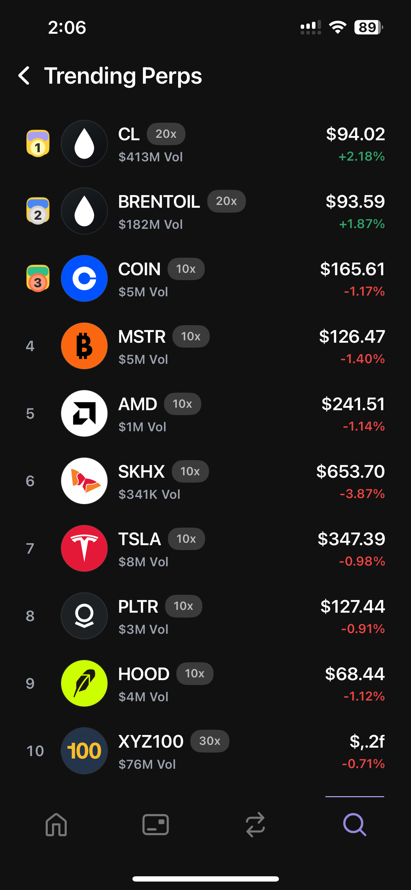
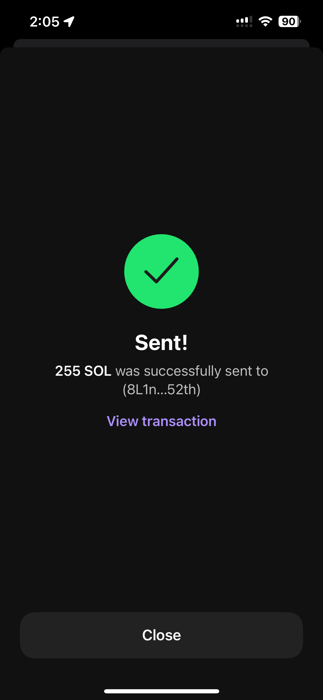

# Phantom Wallet Clone
This is my attempt at a 1:1 Phantom Wallet clone

## Overview
The app includes:

- A custom animated elements (using Rive) 
- Portfolio and balance tracking across multiple assets
- Token detail pages with price/history context
- Send, buy, sell, and swap pages
- Search and discovery for tokens, sites, traders, and markets
- Cash and card style money movement surfaces
- Predictions and perps exploration pages
- Account management, settings, notifications, and internal tooling
- Uses official Phantom API so all results are similar to the real app (may break with updates)
- Supported on IOS 17.6 and up

## Status

- This repo only includes the final built ipa and does not include the source, there is no plan to include source code with builds
- To run this app you will need to download the IPA sign and install with your signer of choice, I would recoment alt-store or sideloadly 
- This project is my atempt to learn swift and show my skills with the language and show off my compleated product.
- This project is no where near done and its still a work in progress to get all UI elements to look closer to the real app and to update current UI elemets to the new UI shown in the real app

Im making these apps to improve my skills with iOS development and show my abilities off to potential employers.

If you have any questions please feel free to reach out to me on [telegram](https://t.me/Fruvss)

  
  
  
  
  
  
  
  
  

