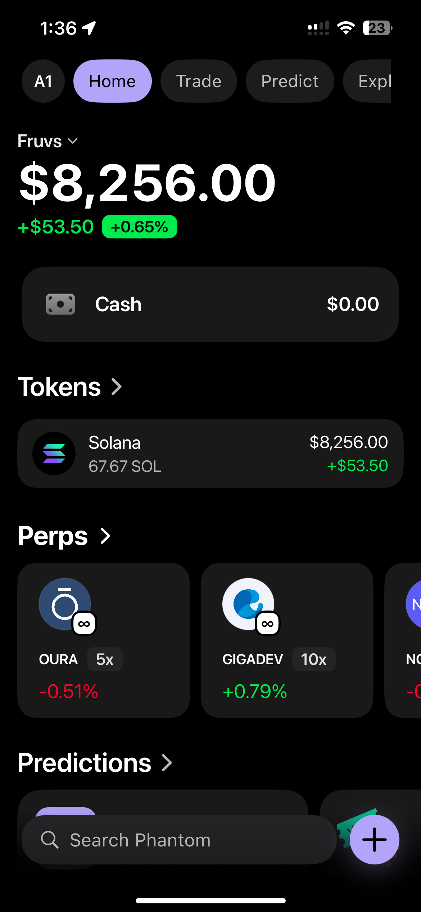
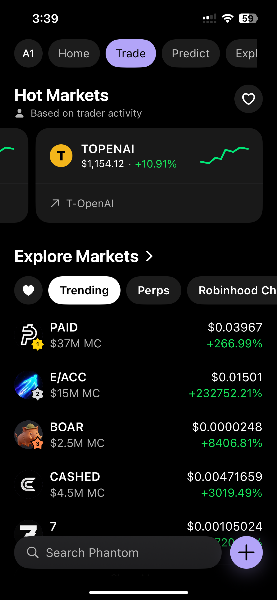
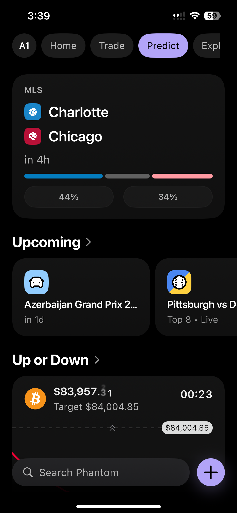
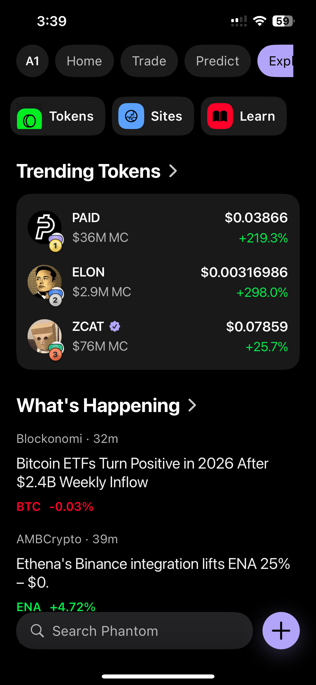
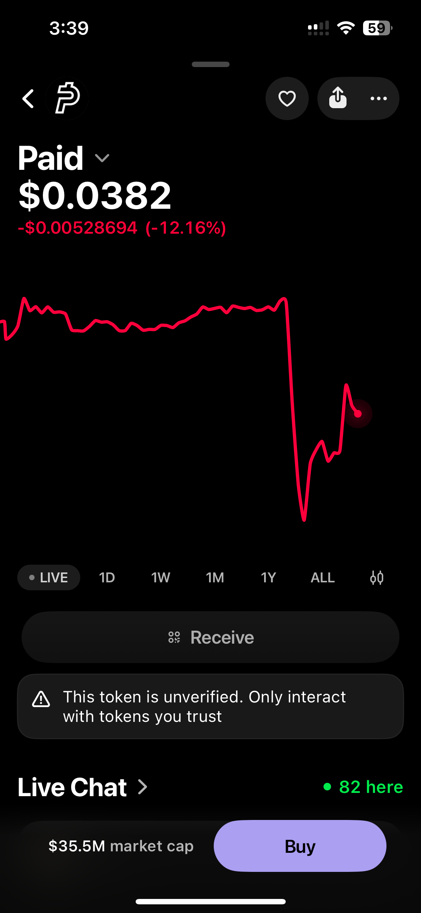
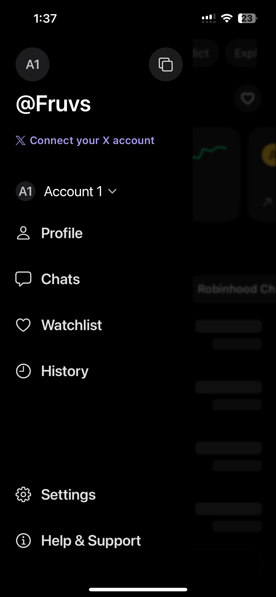
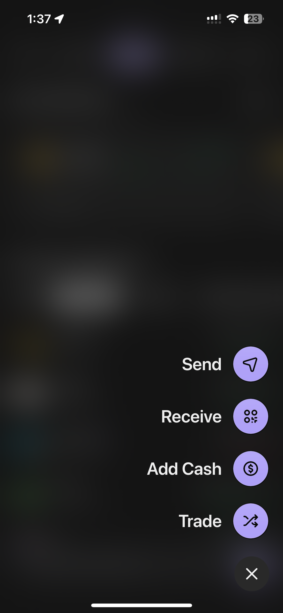

## Overview
The app includes:

- A custom animated elements
- Portfolio and balance tracking across multiple assets
- Token detail pages with price/history context
- Send, buy, sell, and swap pages
- Search and discovery for tokens, sites, traders, and markets
- Cash and card style money movement surfaces
- Predictions and perps exploration pages
- Account management, settings, notifications, and internal tooling
- Supported on IOS 18 and up

## Status

- This repo only includes the final built ipa and does not include the source, there is no plan to include source code with builds
- To run this app you will need to download the IPA sign and install with your signer of choice, I would recoment alt-store or sideloadly 

If you have any questions please feel free to reach out to me on [telegram](https://t.me/Fruvss)

  
  
  
  
  
  
  

